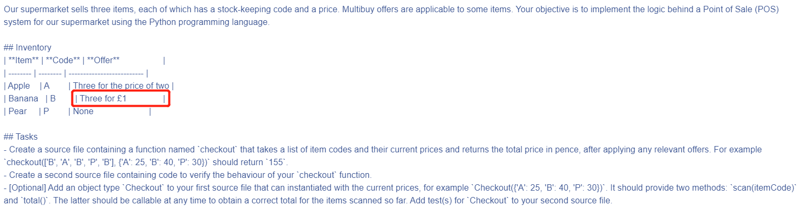

## A simple point-of-sale (POS) example

***Please note that the in the inventory ~~Three for £1~~ offer should be Three for £100 based on the example from task details.***



### Structure


### Test
Run python unit test using the code below:
```
python test_checkout.py
```

